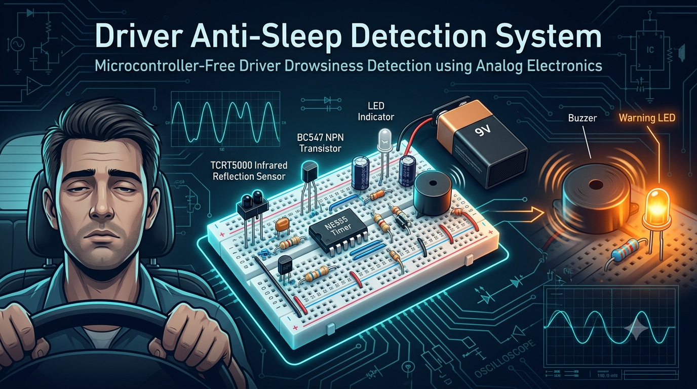
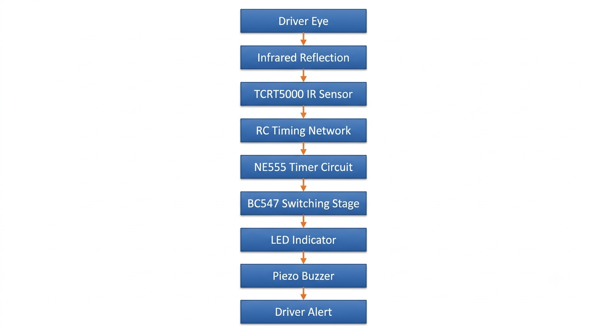
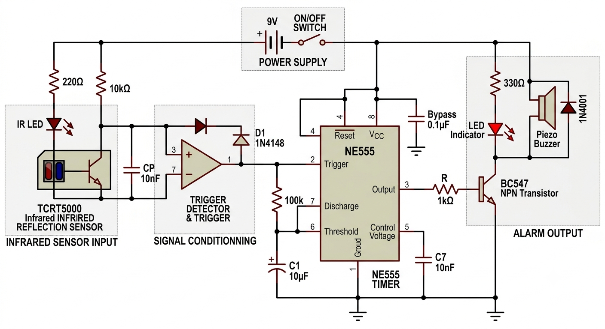
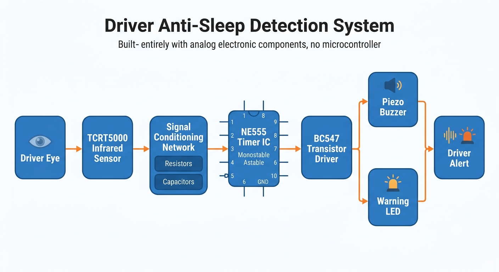
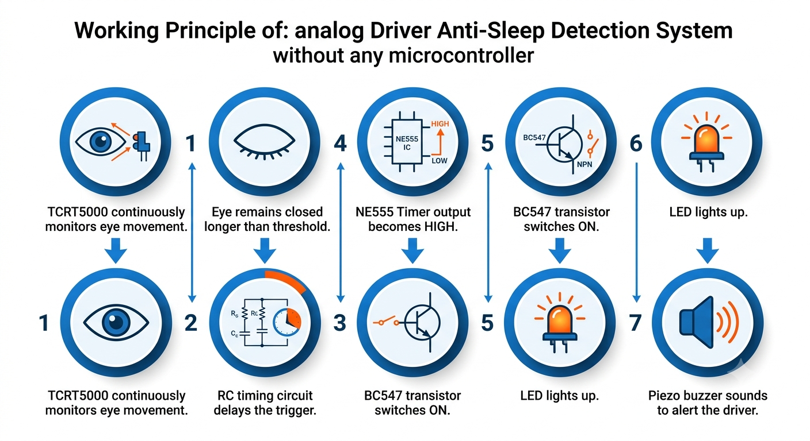
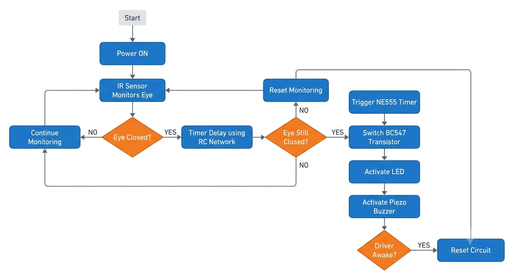
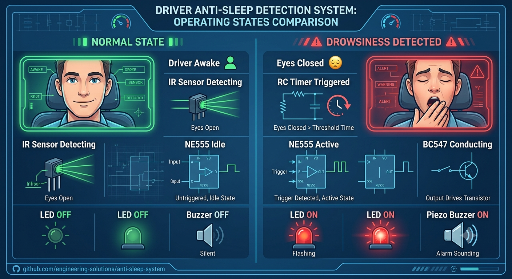
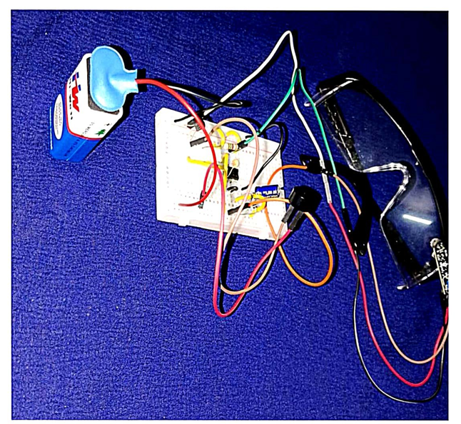

# 😴 Driver Anti-Sleep Detection System

> A pure **analog hardware** solution to detect and alert driver drowsiness — built **without any microcontroller (no Arduino, no ESP32)**, using discrete electronic components and 555 Timer IC logic. Built and tested on hardware.

---

## 🎯 Objective

To design a low-cost, standalone circuit that alerts a driver when signs of drowsiness are detected — demonstrating analog electronics and timer-circuit design skills as an alternative to microcontroller-based solutions.

## ⭐ Why This Project Stands Out

Most drowsiness-detection projects rely on a microcontroller + sensor + code. This one deliberately avoids that path to demonstrate a deeper understanding of:
- Analog signal timing and control logic
- Transistor switching behavior
- 555 Timer IC operating modes (monostable/astable)
- Circuit design without software abstraction

This shows recruiters that the fundamentals of electronics (not just coding a board) are solid — a key differentiator for an ECE-focused embedded role.

## 🔧 Components Used

| Component | Purpose |
|---|---|
| 555 Timer IC | Core timing/pulse generation logic |
| Capacitors | Timing control (RC charge/discharge) |
| Resistors | Current limiting & timing network |
| Diodes | Signal direction control / protection |
| Transistors | Switching stage for buzzer/LED trigger |
| LEDs | Visual alert indicator |
| Buzzer | Audible alarm |

## 🧩 Block Diagram

## 🔌 Circuit Diagram

## 📊 System Architecture

## ⚙️ Working Principle

1. A sensing mechanism feeds a signal into the 555 Timer stage.
2. The 555 Timer is configured to monitor signal timing/duration — if the input pattern matches drowsy behavior, it triggers its output.
3. The output switches a transistor stage ON.
4. The transistor drives the **buzzer + LED**, alerting the driver instantly.
5. Circuit resets automatically for continuous monitoring.

## 🔄 Flowchart

## 📈 Predicted Output

## ✅ Result

The circuit was built and tested on hardware — the drowsiness-detection logic successfully triggered the buzzer and LED alert within the expected timing window, confirming reliable operation of the 555 Timer-based analog design.

## ✅ Features

- Fully analog, no code required
- Instant response time (no microcontroller boot/processing delay)
- Low cost, low power
- Compact and easy to replicate
- Built and tested on real hardware

## 🚀 Future Scope

- Add PIR/IR eye-blink sensor for automatic triggering
- Integrate seatbelt vibration alert
- Combine with a GSM module for emergency SMS alert
- Enclose in a compact dashboard-mountable case

## 🎤 Interview Talking Points

- **Why 555 Timer and not a microcontroller?** — Highlights understanding of analog timing circuits and cost/simplicity tradeoffs.
- **Monostable vs Astable mode** — explain which mode is used here and why.
- **How does the transistor stage work as a switch?**
- **What happens if the timing capacitor value changes?** — ties timing constant (RC) to real-world delay.

## 💰 Bill of Materials (BOM)

| # | Component | Quantity | Approx. Cost (₹) |
|---|---|---|---|
| 1 | 555 Timer IC | 1 | — |
| 2 | Capacitors (assorted) | 3–4 | — |
| 3 | Resistors (assorted) | 4–5 | — |
| 4 | Diodes | 2 | — |
| 5 | Transistors (e.g. BC547) | 1–2 | — |
| 6 | LEDs | 2 | — |
| 7 | Buzzer | 1 | — |
| 8 | Breadboard / PCB | 1 | — |
| 9 | Connecting Wires | — | — |
| 10 | 9V Battery + Connector | 1 | — |
| | **Total** | | **₹ —** |

> *Fill in your actual purchase prices — recruiters like seeing that a project was built on a real, low budget.*

## 🛠️ Tools Used

- Circuit simulation: Proteus / breadboard prototyping
- Multimeter for testing timing accuracy

---

### 👤 Author
**Aswin Saranraj R S**
Final Year ECE | AAMEC, Tiruvarur
🔗 [GitHub](https://github.com/Aswin1617-pro)
